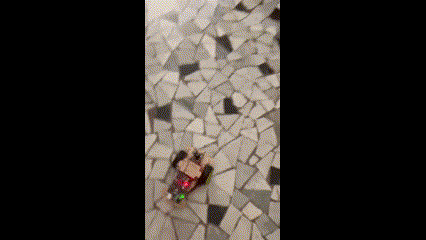

# Obstacle Detection Robot (Ultrasonic Sensor + Servo)

## Overview
This mode enables the robot to detect and avoid obstacles using an **ultrasonic distance sensor**.  
The robot scans left and right with a **servo-mounted sensor** to find a clear path.

## Demonstration  
  

## Notes
- You can adjust the **detection threshold** by modifying `checkDistance()`.
- The servo rotates left and right to find a path when an obstacle is detected.

---
[Back to main repository](../README.md)
